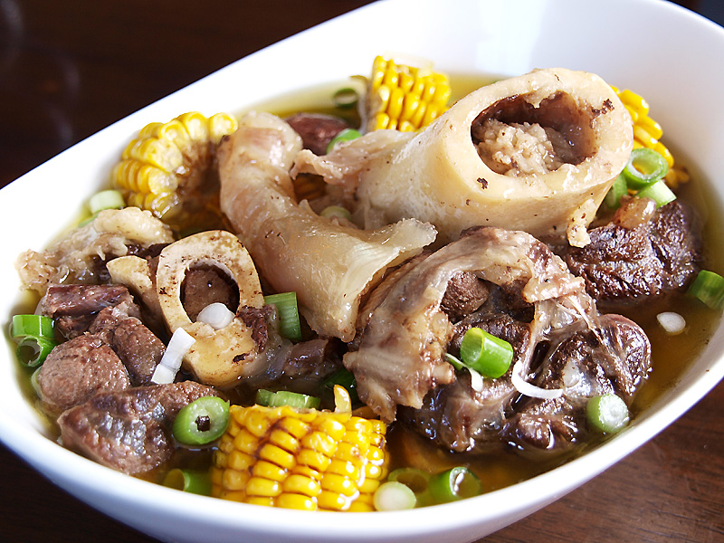

Bulalo is a popular dish in the Philippines, especially in the Southern Tagalog region, where it is regarded as a comfort food and is frequently served in restaurants or street food stalls. The dish is believed to have roots from the province of Batangas, and its popularity has swept across the nation. Being served Bulalo can be considered a gesture of Filipino hospitality and generosity and is frequently served at special occasions such as fiestas and family gatherings.  

**Ingredients**

* 1 kg beef shank with bone marrow
* 160 ml vinegar
* ½ large onion, diced
* 450 grams corn on the cob
* 1 glass white wine
* 350 grams bok choy or pechay
* 1400 grams water
* 1 teaspoon ground black pepper
* 1 teaspoon salt
* 1 teaspoon oregano
* 25 grams grated Parmesan or Gruyere cheese
* Some chopped scallions
* 80 grams chopped garlic
* 80 grams chopped ginger
* 600 ml warm water
* 2 egg yolks
* 4 tablespoons toasted rice powder

## Method

1. In a large pot, add the beef shank with bone marrow, vinegar, onion, and corn on the cob.
2. Pour in the white wine and add enough water to cover the ingredients in the pot.
3. Bring the mixture to a boil and then lower the heat to simmer for 1 hour or until the beef is tender.
4. Add the bok choy or pechay to the pot and continue to simmer for another 5 minutes.
5. Season the mixture with black pepper, salt, and oregano.
6. Add the grated cheese, scallions, garlic, and ginger to the pot and stir well.
7. Beat the egg yolks in a small bowl and add some of the hot broth to temper the yolks.
8. Pour the egg yolk mixture back into the pot and stir well.
9. Sprinkle the toasted rice powder over the bulalo and serve hot.