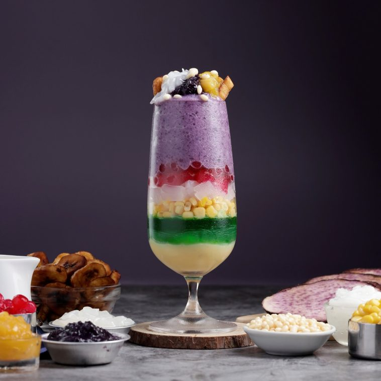

Halo-Halo is a popular Filipino dessert that is popular all year, but especially during the summer. It literally means "mix-mix" in Tagalog, referring to how the dessert is assembled by combining all of the ingredients. It's a colourful and refreshing dessert that typically includes a variety of sweet beans, fruits, jellies, and ice cream, all served over shaved ice and drizzled with evaporated and condensed milk. Halo-Halo is a well-known cultural icon in the Philippines, often associated with happy childhood nostalgia and family gatherings.

**Ingredients:**

* 2 cups shaved ice
* 1/2 cup evaporated milk
* 1/2 cup condensed milk
* 1/4 cup sugar
* 1/4 cup cooked red mung beans
* 1/4 cup cooked garbanzo beans
* 1/4 cup sweet corn kernels
* 1/4 cup kaong (sweet palm fruit)
* 1/4 cup nata de coco (coconut jelly)
* 1/4 cup macapuno (sweetened coconut)
* 1/4 cup jackfruit, sliced
* 1 scoop ube (purple yam) ice cream
* 1 scoop mango ice cream
* 1 scoop vanilla ice cream
* Pinipig (crispy rice flakes), for topping
* Toasted rice flakes, for topping

**Instructions:**

1. In a large bowl, mix together the shaved ice, evaporated milk, condensed milk, and sugar until well combined.
2. Add in the cooked red mung beans, garbanzo beans, sweet corn kernels, kaong, nata de coco, macapuno, and jackfruit. Mix well.
3. Scoop one scoop each of ube, mango, and vanilla ice cream on top of the mixture.
4. Top with pinipig and toasted rice flakes.
5. Serve immediately and enjoy!