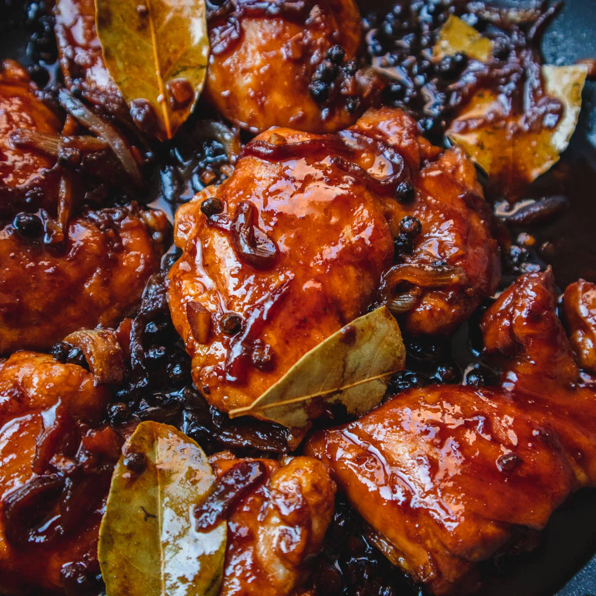

In addition to chicken, other meats such as pork, beef, and seafood can also be cooked in Adobo style. Each region of the Philippines has its own variation of Adobo, with different ingredients and cooking techniques. Overall, Chicken Adobo is a beloved and iconic Filipino dish that showcases the rich and diverse flavours of Filipino cuisine.

## Ingredients

* 1 kg chicken, cut into serving pieces
* 160 ml soy sauce
* ½ large onion, chopped
* 450 grams white vinegar
* 1 glass white wine
* 350 grams garlic, minced
* 1400 grams potatoes, peeled, drained, and chopped into chunks
* 1 teaspoon ground black pepper
* 1 teaspoon ground cumin
* 1 teaspoon dried oregano
* Salt and black pepper to taste
* Some chopped green onions or cilantro for garnish
* 80 grams brown sugar
* 80 grams cooking oil
* 600 ml warm water

## Method

1. In a large mixing bowl, marinate chicken with soy sauce and ground black pepper for 30 minutes to 1 hour.
2. In a pan or pot, heat cooking oil and sauté garlic and onions until fragrant.
3. Add marinated chicken and cook until browned on all sides.
4. Pour in white wine, white vinegar, and warm water. Add potatoes and bring to a boil.
5. Lower the heat and let it simmer for about 30 to 40 minutes until the chicken is tender and the sauce is reduced.
6. Add ground cumin, dried oregano, and brown sugar. Mix well and let it simmer for another 10 minutes.
7. Season with salt and black pepper to taste.
8. Garnish with chopped green onions or cilantro and serve hot with steamed rice.                     

\    the savoury and tangy taste of authentic Filipino Chicken Adobo!