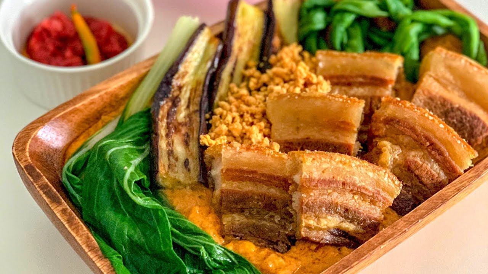

Kare-Kare has a unique flavour profile, combining the sweetness of the peanut sauce with the savoury flavours of the meat and vegetables. Its thick and creamy consistency, along with the addition of bagoong, adds an umami depth of flavour                   

Kare-Kare is a dish that embodies the Philippines' culinary diversity, as it combines indigenous ingredients such as peanuts with Spanish and Chinese cooking techniques. It is also a dish that represents Filipino ingenuity, as it was originally made with oxtail, an inexpensive cut of meat that was transformed into a flavourful and nutritious dish through slow-cooking and the addition of flavourful ingredients.

## Ingredients

* 1 kg beef oxtail, cut into 2-inch pieces
* 1/2 cup peanut butter
* 2 tablespoons annatto seeds
* 2 tablespoons vegetable oil
* 1 large onion, chopped
* 4 cloves garlic, minced
* 8 cups water
* 2 eggplants, sliced
* 1 bundle string beans, cut into 2-inch pieces
* 2 banana blossoms, sliced
* 1 tablespoon fish sauce
* Salt and pepper, to taste
* Bagoong (shrimp paste), for serving
* Steamed rice, for serving

## Method

1. In a large pot, boil the beef tripe and oxtail in water until tender. Drain and set aside.
2. In a separate pan, heat the vegetable oil and sauté the onions and garlic until fragrant.
3. Add the boiled tripe and oxtail to the pan and stir.
4. Add 8 cups of water and bring to a boil.
5. Add the annatto seeds and let simmer for 10 minutes to extract the color.
6. Remove the annatto seeds and add the peanut butter. Stir until well combined.
7. Add the sliced eggplants, string beans, and banana blossoms. Let simmer until the vegetables are cooked.
8. Add fish sauce, salt, and pepper to taste.
9. Serve hot with bagoong on the side and steamed rice.