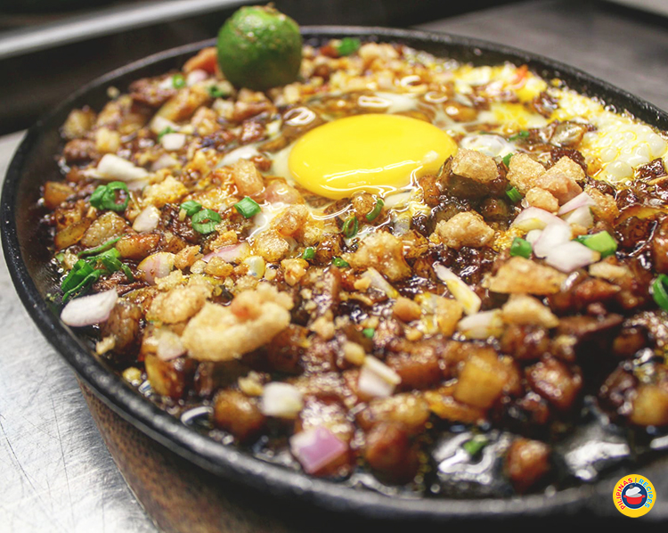

Sisig has cultural relevance in the Philippines and is often served during social gatherings and celebrations. It originated in the Pampanga region of the country, where it was first created by local cooks as a way to use up leftover parts of the pig. In recent years, Sisig has gained widespread popularity both in the Philippines and abroad, with many restaurants and food vendors offering their own unique takes on the dish.

**Ingredients:**

* 1 kg pork belly, boiled until tender and diced
* 160 ml vinegar
* ½ large onion, diced
* 450 grams pig ears, boiled until tender and diced
* 1 glass white wine
* 350 grams chicken liver, diced
* 1400 grams calamansi, drained of some of their juice and chopped
* 1 teaspoon ground black pepper
* 1 teaspoon salt
* 1 teaspoon oregano
* 25 grams grated Parmesan or Kefalotiri cheese
* 1 cup chopped scallions
* 80 grams chopped garlic
* 80 grams chopped ginger
* 600 ml warm chicken stock
* 2 egg yolks
* 4 tablespoons toasted rice powder

**Instructions:**

1. In a large bowl, mix together the diced pork belly, vinegar, onion, and pig ears.
2. Add the white wine, chicken liver, and calamansi to the bowl and mix well.
3. Season the mixture with black pepper, salt, and oregano.
4. Add the grated cheese, scallions, garlic, and ginger to the bowl and mix well.
5. Pour the warm chicken stock over the mixture and stir to combine.
6. Add the egg yolks to the mixture and stir well.
7. Transfer the mixture to a large skillet and cook over medium heat, stirring frequently, until the liquid has evaporated and the mixture is crispy and browned.
8. Sprinkle the toasted rice powder over the Sisig and serve hot.